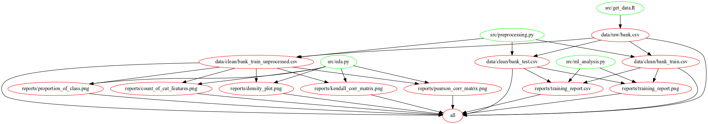

# Marketing campaigns Subscription 
Shiying Wang,  Karlos Muradyan, Gaurav Sinha

# Summary 

In this project data used is related to direct marketing campaigns of a Portuguese banking institution.These marketing campaigns were based on phone calls. Often, more than one contact to the same client was required, to access if the product (bank term deposit) would be ('yes') or not ('no') subscribed. The data set contains 4521 instances and has 17 columns. The data set that we use is in our project is located in this [link](https://archive.ics.uci.edu/ml/machine-learning-databases/00222) and can be easily downloaded and extracted using our [python script](https://github.com/UBC-MDS/DMC_Portuguese_Group_402/blob/master/src/get_data.py). The dataset is publicly available for research, the details of which are described in [Moro et al., 2014].

We aim to predict whether the client subscribed after marketing campaigns. Since this is a classification problem, we use Logistic Regression, SVM and Random Forest. Since the dataset is imbalance, we use F1-score as the evaluation metric, and we also tried Light GBM because it usually can handel imbalance situation. After doing hyper-parameter tuning (except for lightgbm), The SVM model returns the best F1-score (see [result](https://github.com/UBC-MDS/DMC_Portuguese_Group_402/blob/master/reports/training_report.csv)), which is 0.533.

# Report

The final report can be found [here](https://github.com/UBC-MDS/DMC_Portuguese_Group_402/blob/master/doc/report.ipynb).

# Usage

There are two suggested ways to run this analysis:

#### 1. Using Docker
*note - the instructions in this section also depends on running this in a unix shell (e.g., terminal or Git Bash), if you are using Windows Command Prompt, replace `/$(pwd)` with PATH_ON_YOUR_COMPUTER.*

1. Install [Docker](https://www.docker.com/get-started)
2. Download/clone this repository
3. Use the command line to navigate to the root of this downloaded/cloned repo
4. Type the following:

To recreate the project:
```
docker run  --rm -v /$(pwd):/home/DMC_Portuguese_Group_402 sgauravm/dmc-portuguese-data-analysis make -C /home/DMC_Portuguese_Group_402 all
```
*Note: Linux user might have to append sudo before the command above*

To bring the project to original state:
```
docker run  --rm -v /$(pwd):/home/DMC_Portuguese_Group_402 sgauravm/dmc-portuguese-data-analysis make -C /home/DMC_Portuguese_Group_402 clean_all
```

To only clean the data so that report images render:
```
docker run  --rm -v /$(pwd):/home/DMC_Portuguese_Group_402 sgauravm/dmc-portuguese-data-analysis make -C /home/DMC_Portuguese_Group_402 clean_data
```

#### 2. After installing all dependencies (does not depend on Docker)

Clone this GitHub repository, install all [dependencies](https://github.com/UBC-MDS/DMC_Portuguese_Group_402/blob/master/requirements.txt), and run the following command from the root of the repo:

```
make all
```
In order to reset the repo,bring back to a clean state and clean all intermediary files and results, run the following command from project root directory:

```
make clean_all
```
To only delete the `data` folder so that report images render, run the following command from the root directory:

```
make clean_data
```

# Dependencies

The dependencies can be found [here](https://github.com/UBC-MDS/DMC_Portuguese_Group_402/blob/master/requirements.txt)

# Dependency Diagram



# Reference

[Moro et al., 2014] S. Moro, P. Cortez and P. Rita. A Data-Driven Approach to Predict the Success of Bank Telemarketing. Decision Support Systems, Elsevier, 62:22-31, June 2014

UCI Machine Learning Repository. University of California, Irvine, School of Information; Computer Sciences.https://archive.ics.uci.edu/ml/datasets/Bank+Marketing
